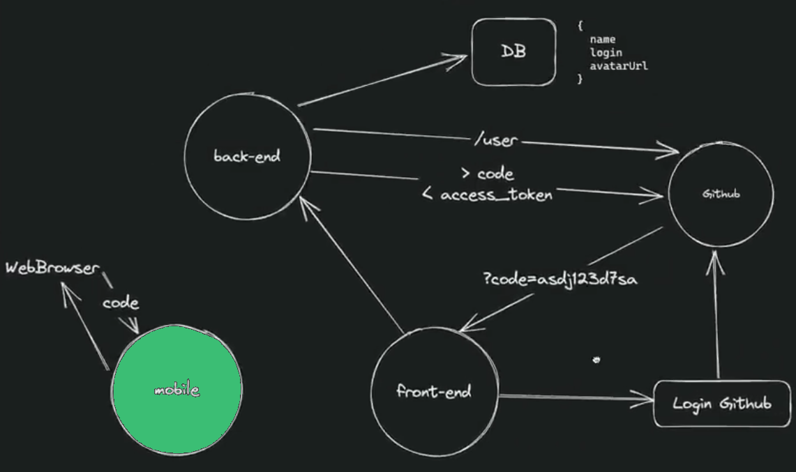
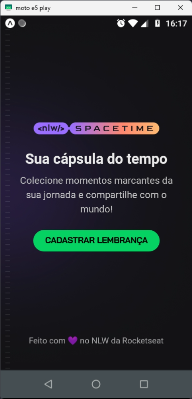
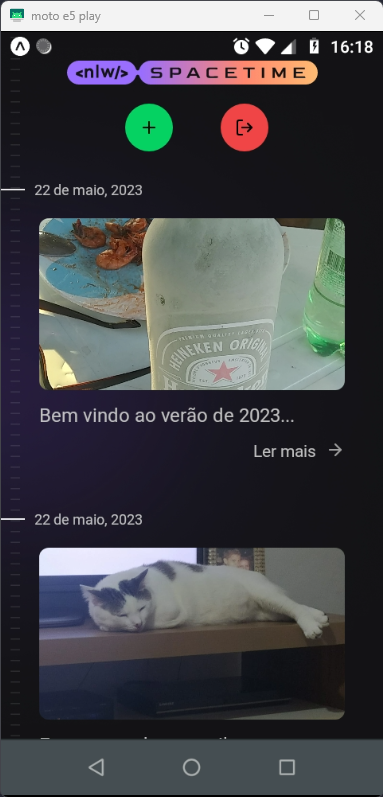
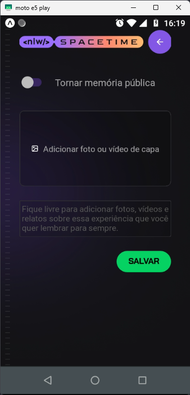
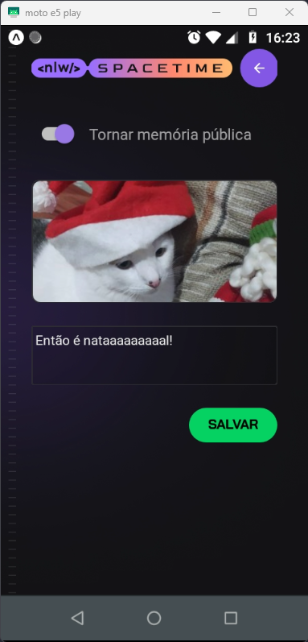
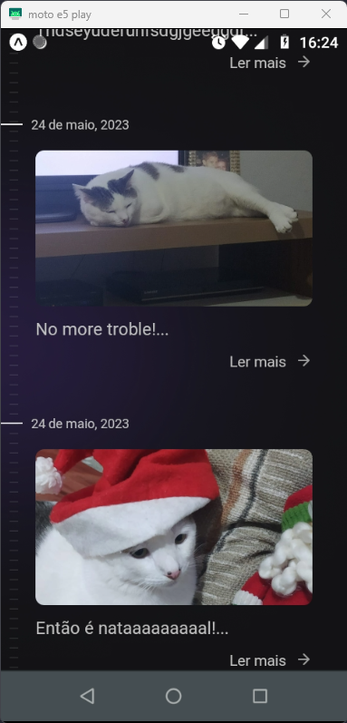

# Mobile / [Back-end](https://github.com/esbnet/nlw-spacetime-server) / [Front-end](https://github.com/esbnet/nlw-spacetime-web) 
<div align="center">


</div>

## Rede Social para Devs


Aqui temos a camada mobile do aplicativo que tem como objetivo permitir o registro de um acontecimento através de um post, bastando informando uma imagen/vídeo e um texto descrevendo o fato.

Teremos no back-end a autenticação do usuário, a permissão de rotas e o logout do usuário, o upload dos arquivos de imgem armazenando em disco (ideal seria um serviço na núvem), bem como os end-points para criar, editar, excluir ou deletar uma memória.

<a id="menu"></a>
## Conteúdo
- [Techs](#techs)
- [Pré-requisitos](#requisitos)
- [Arquitetura](#arch)
- [Instação e Execução](#install)
- [Funcionalidades](#features):
    - [Login](#registrar)
    - [Relação de memórias](#listagem)
    - [Inclusão de memória](#new)
    - [Logout](#logout)

<a id="techs"></a>
## Techs 
- node
- axios
- fastify
  - @fastify/cors
  - @fastify/jwt
  - @fastify/multipart
  - @fastify/static
  - @prisma/client
- prisma / SQLite
- typescript
- tsx
- dotenv
- eslint
- zod

<p style="text-align:right"><a href="#menu">menu</a> &uarr;</p>

<a id="requisitos"></a>
## Pré-requisitos
- Expo
- node versão >= 16.16.0
- npm versão >= 5.2.0 (já trás o npx)
- back-end em execução
<p style="text-align:right"><a href="#menu">menu</a> &uarr;</p>

<a id="arch"></a>
## Arquitetura do projeto / Autenticação OAuth (Github)

A seguir descrevemos as etapas para a autenticação dos clientes (web/mobile) no Github.


1. No cliente (web/mobile), ao clicar em "Criar sua conta", a aplicação aciona o Github com o "GITHUB_CLIENT_ID" préviamente registrado;
2. Após auntenticação no github, ele fornece um código que é enviado para o end-point `/register`;
3. Aqui no back-end, o código recebido do cliente é enviado para o github juntamente como `client_id` e `client_secret` que estão nas variáveis de ambiente;
4. O github devolve um `access_token` e com ele nós fazemos uma chamada na api do git (`https://api.github.com/user`) para pegar os dados do usuário;
5. Neste momento, é verificado no bando de dados do server se este usuário já é cadastrado. Caso não seja, o server registra no banco e em seguida retorna um `access_token` para a chamada do cliente (web/mobile) confirmando a autenticação.

Após este processo, de posse do `access_token`, os clientes poderão realizar chamadas a api do back-end.

<p style="text-align:right"><a href="#menu">menu</a> &uarr;</p>

<a id="install"></a>
## Instalando e Rodar a Aplicação

Para instalar e roda o servidor node basta seguir os passos descritos abaixo:
1. Clonar o projeto: 
```
    git clone https://github.com/esbnet/nlw-spacetime-server.git
```
2. Entrar na pasta do projeto:  
```
    cd nlw-spacetime-server
```
3. Instalar dependências: 
```
    npm install
```
4. Criar na pasta raiz o arquivo `.env` e configurar as credencias geradas no gitrub. Será necessário uma credencial para o acesso via web e outra para acesso via mobile. (Registrar aplicação OAuth no Github [Veja como](#registroGithub) &darr;)
```
    # para aplicação web
    GITHUB_CLIENT_ID_WEB={seu código aqui}
    GITHUB_CLIENT_SECRET_WEB={seu código aqui}

    # para aplicação mobile
    GITHUB_CLIENT_ID_APP={seu código aqui}
    GITHUB_CLIENT_SECRET_APP={seu código aqui}
```
5. Rodar o aplicativo: 
```
    npm run dev
```
6. Criar a variável: 
```
    NEXT_PUBLIC_GITHUB_CLIENT_ID=código_client_id_gerado_no_git
```
7. Criar a variável contendo endereço e porta do servidor (back-end/api)
```
    NEXT_PUBLIC_SERVER_URL=http://0.0.0.0:3333
```
<p style="text-align:right"><a href="#menu">menu</a> &uarr;</p>

<a id="features"></a> 
## Funcionalidades

host:  http://localhost:3333 (endereço do back-end)
- [x] Login / Registro
- [x] Logout
- [x] Inclusão de memória
- [x] Listagem de memória
- [ ] Edição de memória - `PUT /memories/id` 
- [ ] Deleção de memória - `DELETE /memories/id`
- [ ] Filtro de data
- [x] Upload de imagem  - `POST /upload`
- [ ] Upload de vídeo

<p style="text-align:right"><a href="#menu">menu</a> &uarr;</p>

<a id="registrar"></a>
## Login / Registro

Na tela de entrada o usuário pode realizar o registro/login no sistema clicando no botão "CADASTRAR LEMBRANÇA". Com isso o processo de login no Github é realizado e o usuário levado para a relação de memórias.

<div align="center">



</div>

<p style="text-align:right"><a href="#menu">menu</a> &uarr;</p>

<a id="listagem"></a>
## Relação de memórias

Após o login, o usuário é levado para a tela que lista as memórias já cadastradas e permite o usuário realizar duas ações:  incluir nova memória clicando no botão verde com sinal de + e efetuar logout clicando no botão vermelho com um icone de porta com uma seta.

<div align="center">



</div>

<p style="text-align:right"><a href="#menu">menu</a> &uarr;</p>

<a id="new"></a>
## Inclusão de memória

Ao clicar no botão verde, o usuário será levado para um formulário onde deve preencher três campos: "Tornar memória púclica"; "Adicionar foto ou vídeo de capa"; e "Descrição".

<div align="center">



</div>

Preenchendo os campos, bastará apenas clicar no botão verde "SALVAR" que a nova memória será enviada para o back-end, será devidamente registrada.

<div align="center">



</div>

 Após salvar, o usuário será encaminhado de volta para a tela de relação de memórias, agora com a nova memória no final da relação.

<div align="center">



</div>


<p style="text-align:right"><a href="#menu">menu</a> &uarr;</p>

<a id="logout"></a>
## Logout

Para realizar o logout basta clicar no botão vermelho. O sistema exclue o token de acesso, fazendo com que o usuário retorne a tela de login e impedindo o acesso a qualquer outra rota.

<p style="text-align:right"><a href="#menu">menu</a> &uarr;</p>


---
<div align="center">

Este projeto foi construido durante um dos bootcamps promovido gratuitamente pela [rockeseat 🚀](https://rocketseat.com.br) que vem ajudando a carreira de milhares de devs em todo o Brasil. Parabéns aos envolvido!!
<br>


</div>